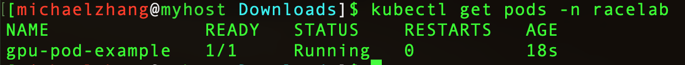
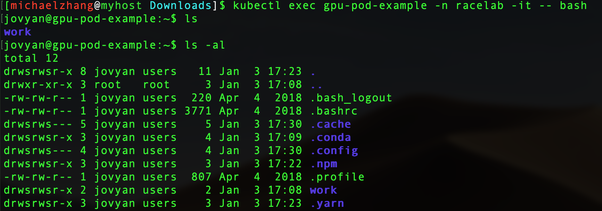
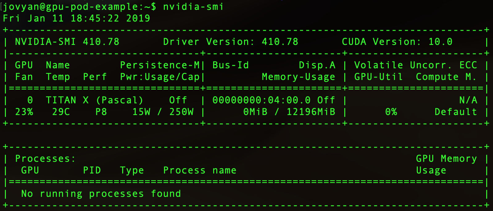

### Nautilus Quick Start

1. [Install](https://kubernetes.io/docs/tasks/tools/install-kubectl) the kubectl tool.  

* Take MacOS for instance:
   
  * ``` brew install kubernetes-cli ```

2. Go to [nautilus](https://nautilus.optiputer.net/) website and register an account

3. Download config file by clicking ```Get Config``` at upper right corner

4. Create ```<home>/.kube``` folder and move the config file to there

5. Let admin add your account to a namespace. After that, test kubectl can connect to your namespace.
* ```kubectl get pods -n your_namespece```

6. Test busybox container in your namespace. Make sure the container shuts down when you log out.

* ```kubectl run busybox -n your_namespace -it --rm --image=busybox -- sh```

7. Craft a dock file and generate image. Then, push it to either [dockerhub](https://hub.docker.com/) or nautilus gitlab [registry](https://gitlab.com/ucsd-prp/prp_k8s_config/container_registry).

8. Use a yaml file to create pod and deploy to kubenetes

``` 
apiVersion: v1
kind: Pod
metadata:
  name: gpu-pod-example
spec:
  containers:
  - name: gpu-container
    image: gitlab-registry.nautilus.optiputer.net/prp/jupyterlab:latest
    args: ["sleep", "infinity"]
    resources:
      limits:
        nvidia.com/gpu: 1
```
Create running pod in your namespace:

``` kubectl create -f https://gitlab.com/dimm/prp_k8s_config/raw/master/tensorflow-example.yaml  -n your_namespace ```

9. Verify the pod example is running

``` kubectl get pods -n your_namespace ```



10. Executing Bash in the container

``` kubectl exec gpu-pod-example -n your_namespace -it -- bash ```



11. Check out the GPU model by ``` nvidia-smi ``` . In our example, the model of GPU is `Titan X`. By modifying the GPU number in yaml file, every node can request up to 8 GPUs.



12. If we are targeting specific GPU type, an additional sector of `affinity` is needed in yaml file. The following example request 1 GPU of Nvidia K40.

```
apiVersion: v1
kind: Pod
metadata:
  name: gpu-pod-example
spec:
  containers:
  - name: gpu-container
    image: tensorflow/tensorflow:latest-gpu
    args: ["sleep", "infinity"]
    resources:
      limits:
        nvidia.com/gpu: 1
  affinity:
    nodeAffinity:
      requiredDuringSchedulingIgnoredDuringExecution:
        nodeSelectorTerms:
        - matchExpressions:
          - key: gpu-type
            operator: In # Use NotIn for other types
            values:
            - K40

```

13. Make sure to shut the pod down when your job is done. Otherwise, your will start receiving alert email from Nautilus and get your account invalidated.

``` kubectl delete https://gitlab.com/dimm/prp_k8s_config/raw/master/tensorflow-example.yaml -n your_namespace ```

